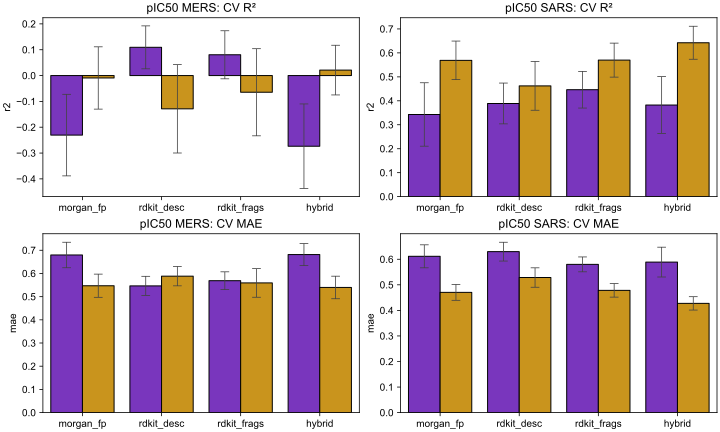
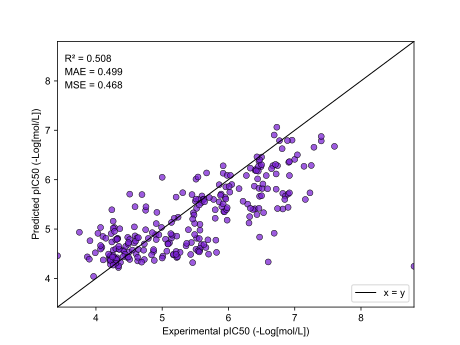
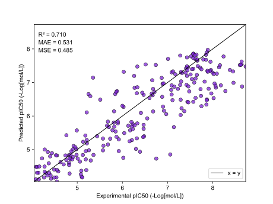

# XGBoost vs MLP in MERS-CoV and SARS-CoV-2 Potency Prediction
A mini research project benchmarking the performance of XGBoost and MLPs performance on the dataset used in the Asap discovery x OpenADMET hackathon. TL;DR: XGBoost using a hybrid featurisation approach achieved performance comparable to challenge winners.

## Dataset
Polaris ([polarishub.io](https://polarishub.io/datasets/asap-discovery/antiviral-potency-2025-unblinded)) is an open-source platform that provides high-quality datasets for machine learning in drug discovery.

The chosen dataset ([source](https://asapdiscovery.org/pipeline/)) contains 1,328 pIC50 values against both the MERS-CoV Mpro target and the SARS-CoV-2 Mpro target. I've chosen this as it is intended to reflect a realistic dataset used in drug discovery settings, unlike other sources such as the [MoleculeNet](https://moleculenet.org/) datasets, which have been criticised for their flaws (see [this blogpost](https://practicalcheminformatics.blogspot.com/2023/08/we-need-better-benchmarks-for-machine.html) by Pat Walters).

This dataset was used in a blind challenge hosted by ASAP Discovery and OpenADMET, with a temporal train:test split, reflecting the nature of the pharamaceutical industry. Though conducted retrospectively, I treated the training and validation procedure as though I was competing in the challenge at the time.

## Benchmarking and Cross-Validation

I implemented a 5×5 cross-validation procedure, testing the "out-of-the-box" performance of XGBoost and MLPs using a range of different featurisation methods;

- Fingerprint: Binary using the Morgan fingerprint algorithm (n_bits = 1024, radius = 3)
- 1D/2D Descriptors: Selected 11 molecular descriptors such as molecular weight and quantitative estimate of drug-likeness.
- Fragment Counts: One-hot encoded vector of the presence of molecular fragments

I proceeded to conduct hyperameter on XGBoost using the hybrid featurisation method, using the `hypopt` package.

## Model Performance
### MERS

### SARS

### Winning submissions:

| Metric | MERS | SARS |
|------:|:--------------|:--------------|
|      R2 | 0.543 ±0.094 | 0.725 ±0.03 |
|      MAE | 0.437 ±0.031 | 0.533 ±0.028 |
|      MSE | 0.461 ±0.117 | 0.487 ±0.052 |

## References
1. MacDermott-Opeskin, H., Scheen, J., Wognum, C., Horton, J. T., West, D., Payne, A. M., ... & Chodera, J. D. (2025). A computational community blind challenge on pan-coronavirus drug discovery data.
2. Fischer, Y., Southiratn, T., Triki, D., & Cedeno, R. (2025). Deep Learning vs Classical Methods in Potency and ADME Prediction: Insights from a Computational Blind Challenge. Journal of Chemical Information and Modeling.