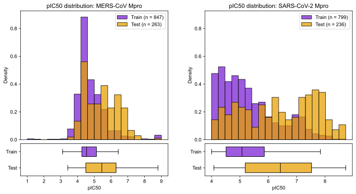

# XGBoost vs MLP in MERS-CoV and SARS-CoV-2 Potency Prediction
A mini research project benchmarking the performance of XGBoost and MLPs performance on the dataset used in the Asap discovery x OpenADMET hackathon. TL;DR: XGBoost outperforms MLPs, particularly using only a few (~8) molecular descriptors. Optimised model performance is comparable to challenge winners.

## Dataset
Polaris ([polarishub.io](https://polarishub.io/datasets/asap-discovery/antiviral-potency-2025-unblinded)) is an open-source platform that provides high-quality datasets for machine learning in drug discovery.

The chosen dataset ([source](https://asapdiscovery.org/pipeline/)) contains 1,328 pIC50 values against both the MERS-CoV Mpro target and the SARS-CoV-2 Mpro target. I've chosen this as it is intended to reflect a realistic dataset used in drug discovery settings, unlike other sources such as the [MoleculeNet](https://moleculenet.org/) datasets, which have been criticised for their flaws (see [this blogpost](https://practicalcheminformatics.blogspot.com/2023/08/we-need-better-benchmarks-for-machine.html) by Pat Walters).

This dataset was used in a blind challenge hosted by ASAP Discovery and OpenADMET, with a temporal train:test split. Though conducted retrospectively, I treated the training and validation procedure as though I was competing in the challenge at the time.

